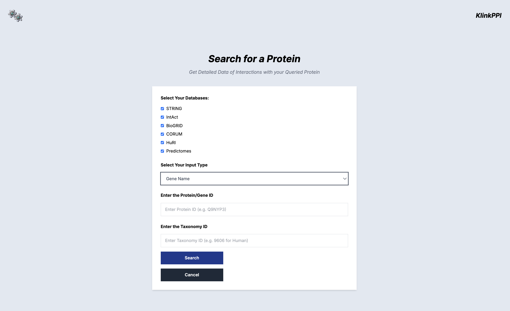
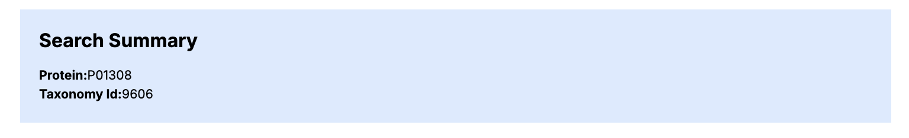
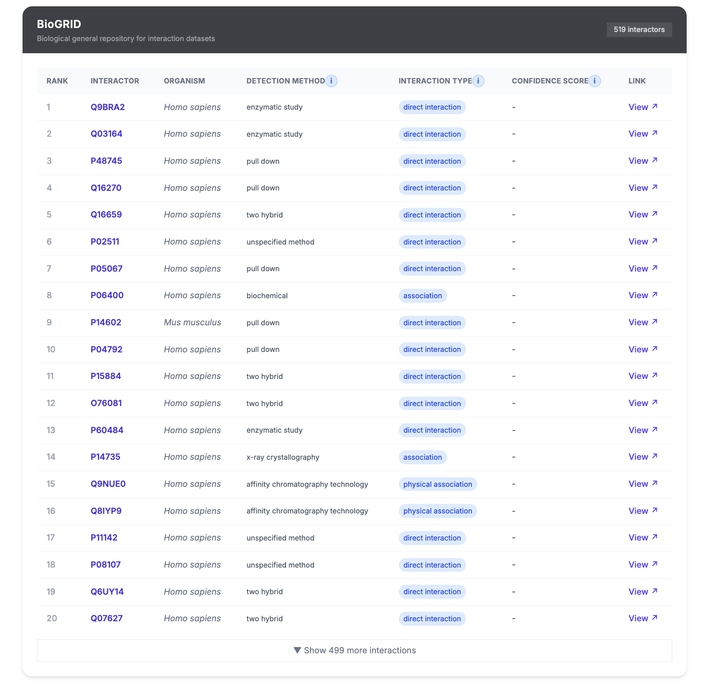
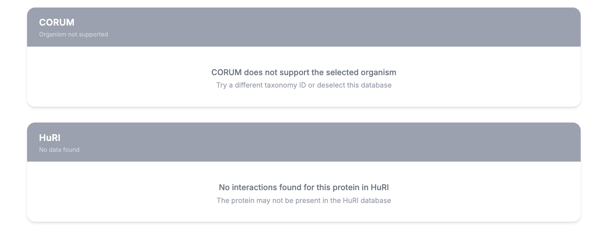
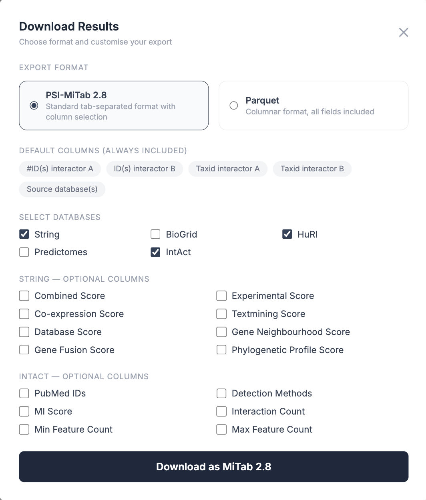
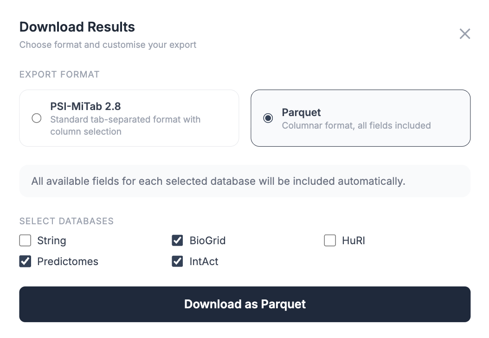

# ClinkPPI
Combining different ppi databases
ClinkPPI is a Protein Protein Interaction Databases integerator. The aim was to solve a problem with the current proteomics databases, which was that there currently exists a wide landscape of protein interaction databases, where some are specialised for certain species(ex. Predictomes and HuRI for humand),some contain large number of species(ex. STRING,BioGrid), while some are protein complex databases(ex. CORUM). Our solution was to include 6 databases i.e STRING,CORUM,IntAct,BioGrid,HuRI and Predictomes into a unified web page dispalying all the information of these databases in a highly customisable and downloadable manner.

Search Bar
1. Allowing the users to selected the databases to get the results from.
2. Accepting UniProtKb,Ensembl GeneID and Gene Name as inputs.
3. Allows the user to input the Taxonomy ID of the input, which makes our search after.

## Search Bar

Results Page
1. The results are sepeartated by the selected databases.
2. The results contain the important columns specific to the database sorted in descenign order.
3. the 'i' button helps to get description regarding the column.
4. The 'Link' column redirects the user to the interactor searched in that specific database
5. 20 interactions are shown in one go and can be expanded to see all the interactions.
6. For the databases that dont have any information we show clear information about the non existence of data in the database.

Downloading the Data
1. We allow the users to allow data in the a highly customisable manner in the PSI-MI TAB 2.8 Format, which is the standard format used by the community and is a tab seperated format .
2. We allow the users to pick and choose which specific columns does the user want from each database, allowing a highly customisable MI TAB file thereby making the file even more humand readable.
3. Apache Parquet file has also been incorporated as the TAB file can get extremely complex and large for 1000s of interactions therefore we have implements the binary parquet file format as well. This format can also be used for machine learning and other secondary analysis.

