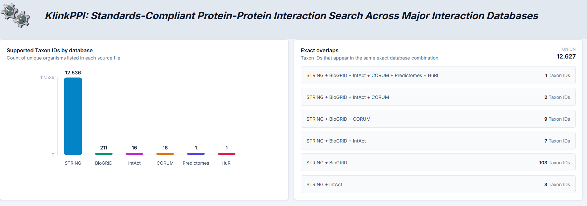
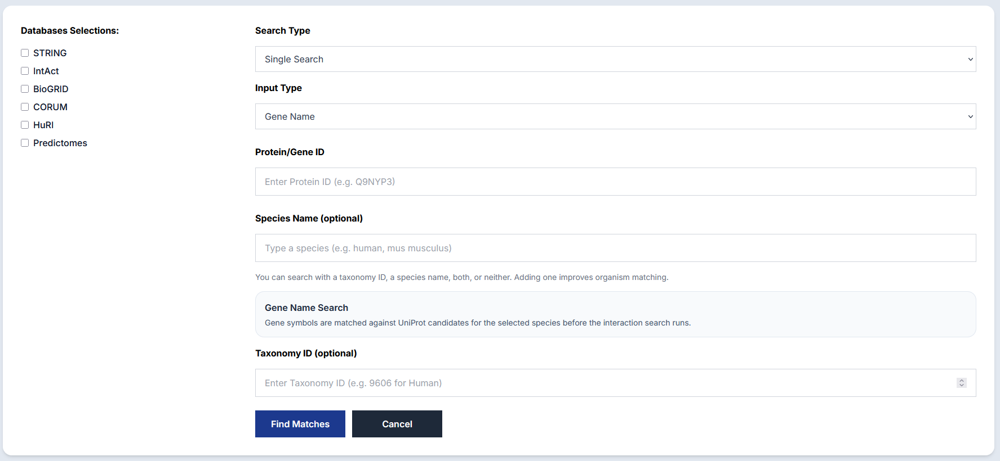
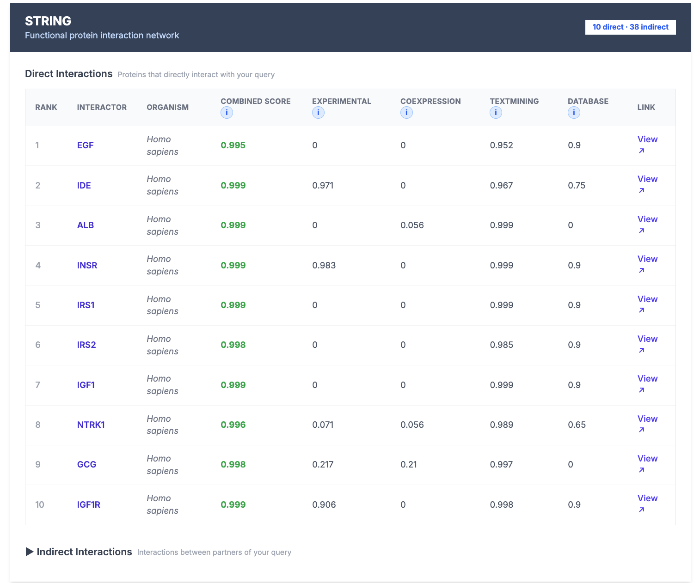

# KlinkPPI

KlinkPPI is a web application for exploring protein-protein interaction (PPI) data across multiple sources from one interface. It combines results from `STRING`, `CORUM`, `IntAct`, `BioGRID`, `HuRI`, and `Predictomes`, then lets users inspect and download the results in a `PSI-MI TAB 2.8`-compatible tab-delimited format or `Parquet`.

## Features

- Search by `UniProtKB`, `GeneID`, `Ensembl`, or `Gene Name`
- Filter queries by taxonomy ID
- Query one database or several at once
- Review results in separate sections by database
- Download selected results as `MI TAB`-compatible tab-delimited files or `Parquet`

## Examples

### Intro



### Search



### Results




## Project Structure

- `backend/`: FastAPI backend
- `frontend/`: React + Vite frontend
- `Data/`: local database files used by several backend resolvers
- `../Supported_Organisms/`: taxonomy support tables for each source

## Prerequisites

- `Python 3.11+` recommended
- `Node.js 20.19+` or `22.12+`
- `npm`

`Node.js 18` is not sufficient for the current Vite version in this repository. For installing the new one: 

```bash
# 1. Download and run the install script
curl -o- https://raw.githubusercontent.com/nvm-sh/nvm/v0.40.5/install.sh | bash

# 2. Load NVM into your current terminal session
# (Try bashrc first; if you use zsh, replace with ~/.zshrc)
export NVM_DIR="$HOME/.nvm"
[ -s "$NVM_DIR/nvm.sh" ] && \. "$NVM_DIR/nvm.sh"

# 3. Verify installation
nvm --version
nvm install 20
nvm use 20
   
```

## Installation

Clone the repository and work from the project root:

```bash
git clone <your-repo-url>
cd KlinkPPI
```

Install the backend and frontend dependencies from the project root:

```bash
npm install
```

This creates `.venv/`, installs `requirements.txt`, and installs the frontend npm packages.

## Running the Application

Start both the FastAPI backend and Vite frontend from one terminal:

```bash
npm run dev
```

Then open:

```text
http://localhost:5174
```

## Notes

- The frontend is configured to connect with to the backend at `http://127.0.0.1:8000`.
- The backend CORS configuration currently allows `http://localhost:5174`.
- Several backend resolvers call external services such as UniProt, Ensembl, STRING, and IntAct, so an internet connection is required for full functionality.
- If `npm run dev` or `npm run build` fails after switching Node versions, remove stale dependencies and reinstall with `npm install`.
- MITAB exports use shared core columns for all selected databases. The `Source database(s)` field uses verified PSI-MI source terms where available: `psi-mi:"MI:1014"(string)`, `psi-mi:"MI:0463"(biogrid)`, and `psi-mi:"MI:0469"(intact)`. Sources without verified PSI-MI database terms are exported as `corum`, `huri`, and `predictomes`.

## Download Columns

The columns below assume all databases and all optional evidence fields are selected. Parquet exports use the union of database-specific fields; fields that do not apply to a row are empty or `-`.

### Single-Protein MITAB-Compatible Export

Single-protein MITAB-compatible downloads always use the same shared columns:

| Column |
| --- |
| `#ID(s) interactor A` |
| `ID(s) interactor B` |
| `Taxid interactor A` |
| `Taxid interactor B` |
| `Interaction detection method(s)` |
| `Interaction type(s)` |
| `Publication Identifier(s)` |
| `Source database(s)` |
| `Confidence value(s)` |

Database-specific values are encoded inside these shared columns. For example, STRING scores are written as `string-combined-score:<value>`, BioGRID confidence as `biogrid-confidence-score:<value>`, IntAct scores as `intact-miscore:<value>`, CORUM metadata as `corum-complex-name:<value>`, and Predictomes scores as `predictomes-spoc-score:<value>`.

### Single-Protein Parquet Export

Single-protein Parquet exports include these fields when all databases are selected:

| Database | Columns |
| --- | --- |
| BioGRID | `Database`, `Interactor_A`, `Interactor_B`, `organism`, `Interaction_Detection_Method`, `Interaction_Type`, `Confidence_Score` |
| CORUM | `Database`, `complex_name`, `cell_line`, `Purification_Method`, `Interactor_A`, `Interactor_B`, `Organism` |
| Predictomes | `Database`, `Interactor_A`, `Interactor_B`, `spoc_score`, `kirc_score`, `num_unique_contacts` |
| STRING | `Database`, `Interactor_A`, `Interactor_B`, `Organism`, `combined_score`, `gene_neighbourhood_score`, `gene_fusion_score`, `phylogenetic_profile_score`, `experimental_score`, `coexpression_score`, `textmining_score`, `database_score` |
| IntAct | `Database`, `Interactor_A`, `Interactor_B`, `Num_Interaction_IntAct`, `Minimum_feature_count`, `Maximum_feature_count`, `Interaction_Score_Intact`, `Unique_Identification_Methods`, `PubMed_Ids` |
| HuRI | `Database`, `Interactor_A`, `Interactor_B`, `Interactor_A_UniProt`, `Interactor_B_UniProt`, `Interactor_A_Ensembl`, `Interactor_B_Ensembl` |

### Complete-Species MITAB-Compatible Export

Complete-species MITAB-compatible downloads use the same shared columns as single-protein MITAB-compatible downloads:

| Column |
| --- |
| `#ID(s) interactor A` |
| `ID(s) interactor B` |
| `Taxid interactor A` |
| `Taxid interactor B` |
| `Interaction detection method(s)` |
| `Interaction type(s)` |
| `Publication Identifier(s)` |
| `Source database(s)` |
| `Confidence value(s)` |

The `Source database(s)` values follow the same rule as single-protein MITAB exports: verified PSI-MI source terms are used for STRING, BioGRID and IntAct; CORUM, HuRI and Predictomes are written as source names.

### Complete-Species Parquet Export

Complete-species Parquet exports include these fields when all databases are selected:

| Database | Columns |
| --- | --- |
| STRING | `Database`, `String_Id_A`, `String_Id_B`, `Interactor_A`, `Interactor_B`, `Interactor_A_Prefix`, `Interactor_B_Prefix`, `Interactor_Gene_Name_A`, `Interactor_Gene_Name_B`, `preferred_name_A`, `preferred_name_B`, `annotation_A`, `annotation_B`, `combined_score`, `gene_neighbourhood_score`, `gene_fusion_score`, `phylogenetic_profile_score`, `experimental_score`, `coexpression_score`, `textmining_score`, `database_score` |
| IntAct | `Database`, `Interactor_A`, `Interactor_B`, `Interactor_A_Prefix`, `Interactor_B_Prefix`, `Interactor_Gene_Name_A`, `Interactor_Gene_Name_B`, `Taxid_A`, `Taxid_B`, `Unique_Identification_Methods`, `PubMed_Ids`, `Interaction_Score_Intact`, `Num_Interaction_IntAct`, `Minimum_feature_count`, `Maximum_feature_count`, `Interaction_Type`, `Source_Database`, `Publication_Identifiers_Raw` |
| BioGRID | `Database`, `Interactor_A`, `Interactor_B`, `Interactor_Gene_Name_A`, `Interactor_Gene_Name_B`, `organism`, `Interaction_Detection_Method`, `Interaction_Type`, `Confidence_Score` |
| CORUM | `Database`, `Interactor_A`, `Interactor_B`, `Interactor_Gene_Name_A`, `Interactor_Gene_Name_B`, `Organism`, `complex_name`, `cell_line`, `Purification_Method` |
| Predictomes | `Database`, `Interactor_A`, `Interactor_B`, `Interactor_Gene_Name_A`, `Interactor_Gene_Name_B`, `spoc_score`, `kirc_score`, `num_unique_contacts` |
| HuRI | `Database`, `Interactor_A`, `Interactor_B`, `Interactor_A_UniProt`, `Interactor_B_UniProt`, `Interactor_A_Ensembl`, `Interactor_B_Ensembl` |

## API Endpoints

- `GET /search`
- `POST /mitab`
- `POST /parquet`
